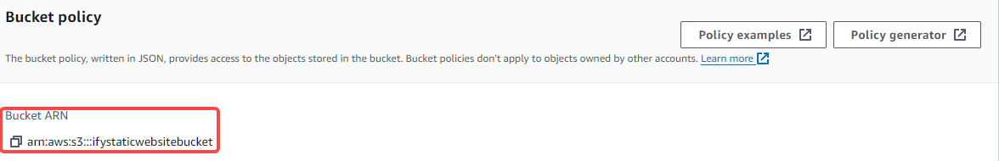

# How-to-host-an-AWS-Static-Website
My learnings about hosting an AWS Static Website

# Introduction

A simple step by step guide to creating an AWS S3 Static Website .

## Definition of terms
**Amazon S3** (Simple Storage Service) is a highly scalable cloud storage service provided by Amazon Web Services (AWS). It is designed to store and retrieve any amount of data from anywhere on the web..

**Bucket** is a container for storing objects on AWS S3.

**Bucket Policy** are a set of rules ,instructions or permissions that you can attach to an Amazon S3 bucket to control who can do what with the objects (files) stored in that bucket. 

**Create an S3 bucket using the AWS console and upload the attached index.html file**

**Step 1:** Login to your AWS console using your IAM username and password, by visiting [aws.com](https://aws.amazon.com) selecting sign in to console.

**Step 2:** Type "S3" into the search bar located at the top of the screen to locate and choose the S3 user console..

 **Step 3:** Click Create Bucket, then you select a region from the drop down menu, type in a unique Bucket Name for your bucket.

 
 

 **Step 4:** Object Ownership - Click on ACLs enabled, then give public access by unchecking the box that says Block all public access and check the warning box to acknowledge that you want to make the objects in the bucket public.

 

 **Step 5:** Allow public access by unchecking the box that says block all public access as the website needs to be accessible to everyone and check the warning box to acknowledge that you are granting public access to the objects.

**Step 6:** Leave all other settings as default then click create bucket.

**Step 7:** Select the just created bucket from the general purpose bucket 

**Step 8** You upload and then add file

  Select Upload

## Modify the S3 Bucket

**Step 1** You should already be in your bucket if not select your just created bucket from the general purpose buckets and then select properties. Then in the properties tab scroll to the bottom you will see the section Static Website Hosting, you select edit to enable static website hosting

**Step 2** Once you select Edit you will select Enable for Static Website Hosting. You will also need to type in your Index Document you uploaded previously this is the default/home page for your website. Then you select save changes.

 Static Website Hosting is now Enabled and it should also show the website we added in index document. if you try to access the website from the link it will not work but instead will give you an error message of 403 Forbidden on the webpage, we will be fixing that in our next steps.

 

 **Step 3** Still inside your created buckey you will select the Permissions tab.

**Step 4:** Scroll down to the Bucket policy section , there should be no policy displayed

Select Edit to add a bucket policy, then select Policy Generator(this will help you to write the necessary code to make your bucket public).

**Step 5** Within the Policy Generator, select Type of Policy as S3 Bucket Policy, Allow Effect, in the Principal add a * this basically allows anyone to get the object in the bucket.

In Actions, you will select from the drop down GetObject.

For the Amazon Resource Name (ARN), you will have to go back to the Edit Bucket Policy screen and copy the Bucket ARN provided.

Click the Policy Generator again then paste the ARN in the Amazon Resource Name box. At the end of the name you will need to type /*. The /* is to enable the GetObject action to retrieve the object in ARN box from the bucket. Then you select Add Statement. Then you click the button Generate Policy.

Then you copy the policy it generates. 

**Step 6:** Go back to the Edit Bucket Policy screen and paste the policyy generated (this is also a code) in the Policy window and select save changes.

.png)

**Step 7** Click the permissions tab of the bucket and it should now be showing Access as Public.

 ## **Verify internet access using the Bucket website endpoint and the Object URL.**

 **Step 1:** To access the Bucket Website Endpoint select the Properties tab of the Bucket. Then scroll to the bottom to the Static Website Hosting tab and you will see the Website Endpoint.

 

**Step 2:** Click the endpoint and the website will appear. 

